# Welcome to QCfirst

The final programming project of CS355
<a href="https://jihoonk-1116.github.io/finalProject/index.html" target="_blank"> [index page]</a>
 (Both of the student and the instructor sides can be access from the index page, choosing the role.)

<a href="https://github.com/jihoonk-1116/jihoonk-1116.github.io/tree/master/finalProject">Instructor side source code</a> - Chihoon Kim 
<a href="https://github.com/ganiasif98/ganiasif98.github.io/tree/master/Final">Student side source code</a> - Asif Gani

#### Contributors:
Chihoon Kim (https://github.com/jihoonk-1116) 
Asif Gani (https://github.com/ganiasif98)

# Visual Designs of QC first
* [Site](#sitemap)
* [Login Page](#login)
* [Sign-up Page](#sign-up)
  

* [Student](#student)
    * [Student-Overview](#student-overview)
    * [Add classes](#add-class)
    * [Edit-Profile-Window](#edit-student-profile)
    * [Enroll-Class](#enroll-class)
  
  
* [Instructor](#ins)
    * [Overview](#overview-ins)
    * [My Schedule](#schedule)
    * [Roaster](#roaster)
    * [Student Details Mini-window](#student-details-ins)
    * [Class Details Mini-window](#class-details-ins)
    * [Add a new class Mini-window](#add-mini-ins)
    * [Remove class Mini-window](#remove-mini-ins)
   
## Site Map 
# 
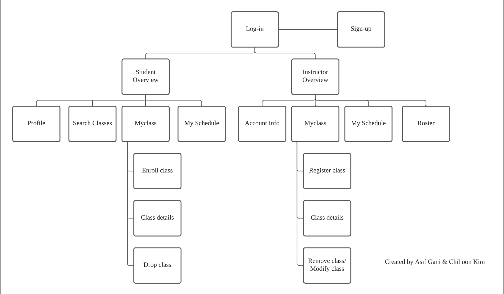

## Login Page 
# 
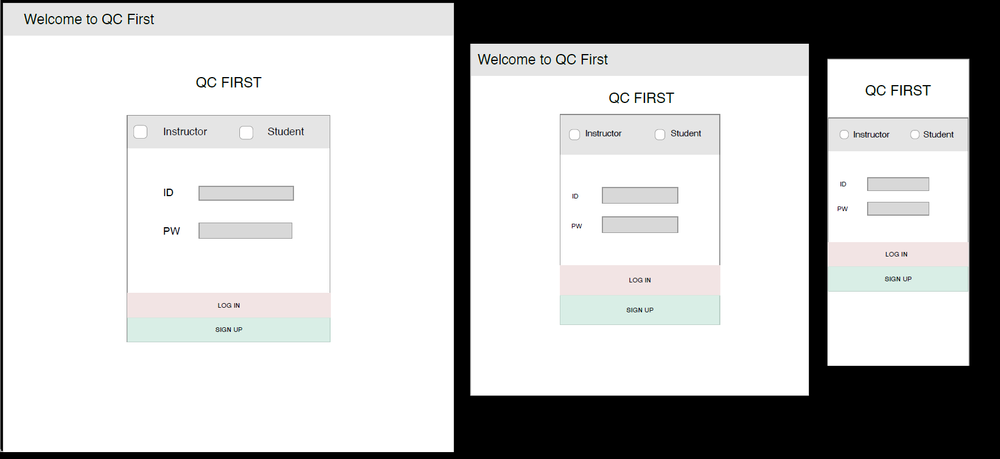
Log-in page decides that a user is a student or an instructor. <a href="instructor\index.html" target="_blank">[Code]</a><a href="https://jihoonk-1116.github.io/final/index.html" target="_blank"> [Page]</a>

## Sign-up page
# 
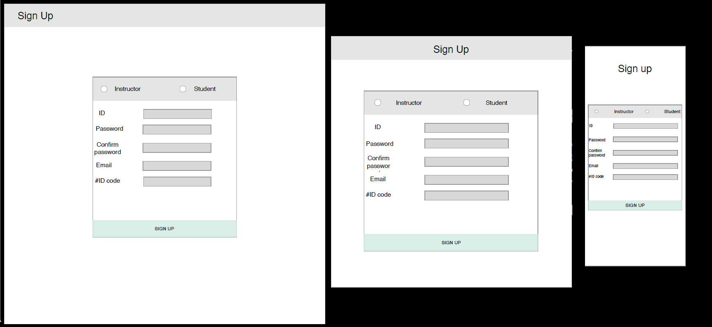
Users who want to sign-up are required their unique given number. <a href="instructor\signup.html" target="_blank">[Code]</a><a href="https://jihoonk-1116.github.io/final/signup.html" target="_blank"> [Page]</a>

# Student side

### Overview page
# 
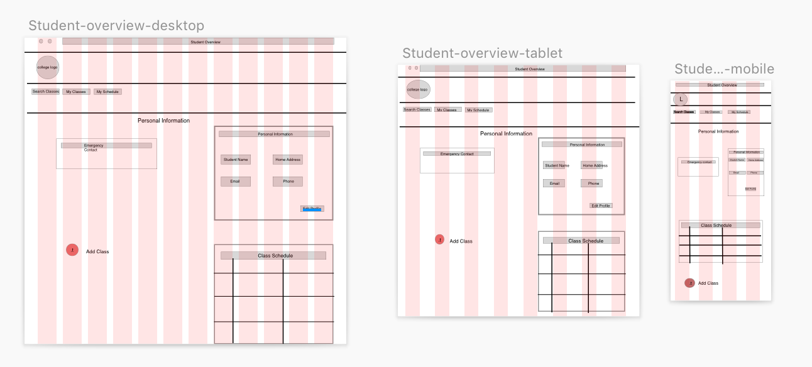
On this page you are able to view the information about the student, view their schedule for that semester, and a link to add classes. 
<a href="Student\student_overview.html" target="_blank">[Code]</a><a href="https://ganiasif98.github.io/Final/student_overview.html" target="_blank"> [Page]</a>

### Edit Profile Mini Window
# 
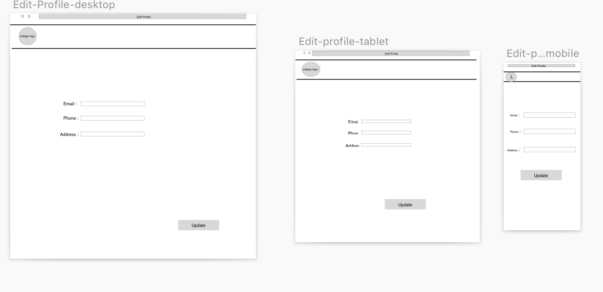
This is a window that will be opened when the edit profile button is clicked, and here you can update the information about the student.
<a href="Student\edit_profile.html" target="_blank">[Code]</a><a href="https://ganiasif98.github.io/Final/edit_profile.html" target="_blank"> [Page]</a>

### Add Class
# 
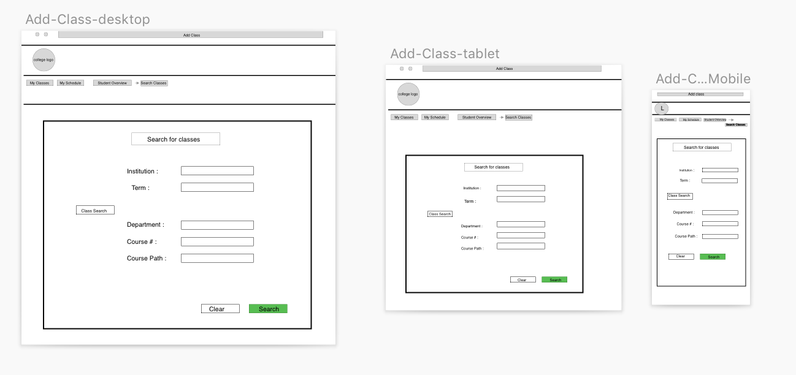
Here students can search classes depending upon which college they go to, the semester they want to search classes from, as well as the course #, or name. Also have the option to modify the search or clear the search.
<a href="Student\search_class.html" target="_blank">[Code]</a><a href="https://ganiasif98.github.io/Final/search_class.html" target="_blank"> [Page]</a>

### Enroll Class
# 
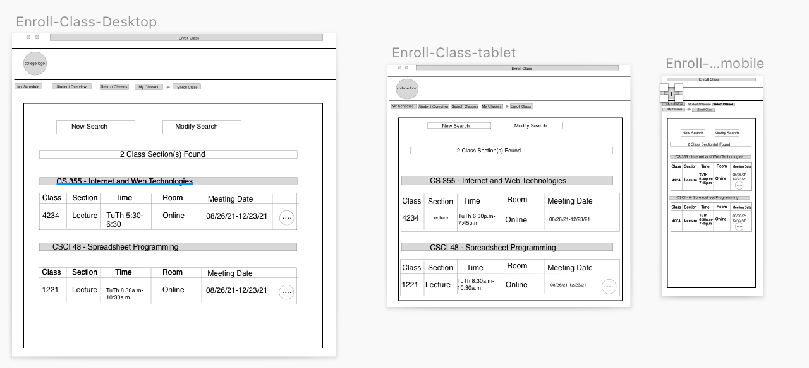
Here students can view all the classes that corresponds to the given search in the previous window By the clicking the 3 dots you are redirected to another link where you can add the class.
<a href="Student\enroll_class.html" target="_blank">[Code]</a><a href="https://ganiasif98.github.io/Final/enroll_class.html" target="_blank"> [Page]</a>

### Detail Page 1
<a href="Student\class_detail.html" target="_blank">[Code]</a><a href="https://ganiasif98.github.io/Final/class_detail.html" target="_blank"> [Page]</a>

### Detail Page 2
<a href="Student\class_detail2.html" target="_blank">[Code]</a><a href="https://ganiasif98.github.io/Final/class_detail2.html" target="_blank"> [Page]</a>

# Instructor side 
### Overview page 
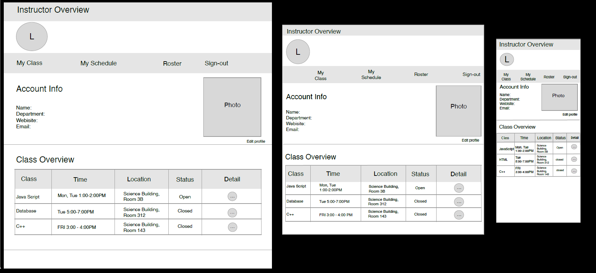
This page gives overall information about a instructor's class. 

### My Schedule 
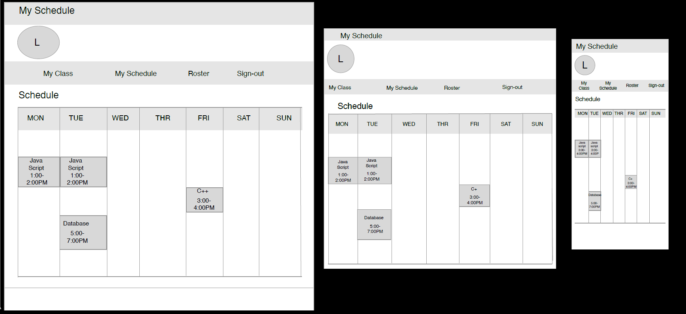
Instructors enable to check his or her schedules visually on this page.

### Roster 
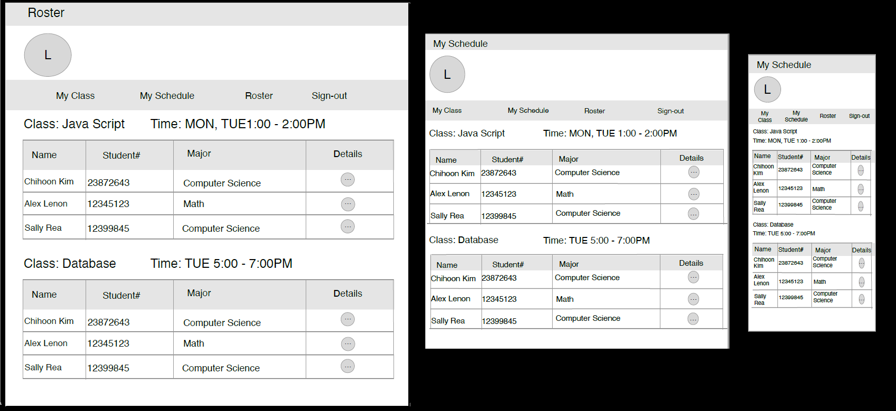
Instructors can access students' information who register the instructor's class. 

### Student Details Mini-window 
##### *All of these Mini-window designs are using 8-grid for desktop, tablet  and 4-grid for mobile.
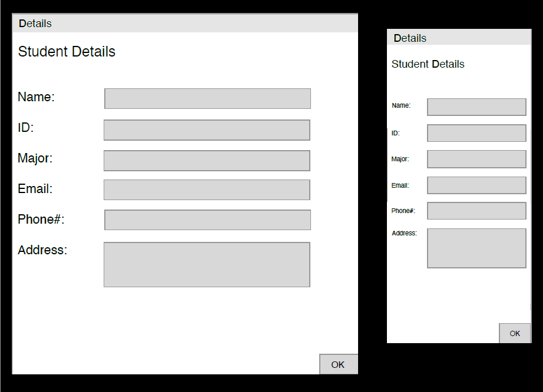
This mini-window is for checking a student details, and is connected with the roaster page.

### Class Details Mini-window 
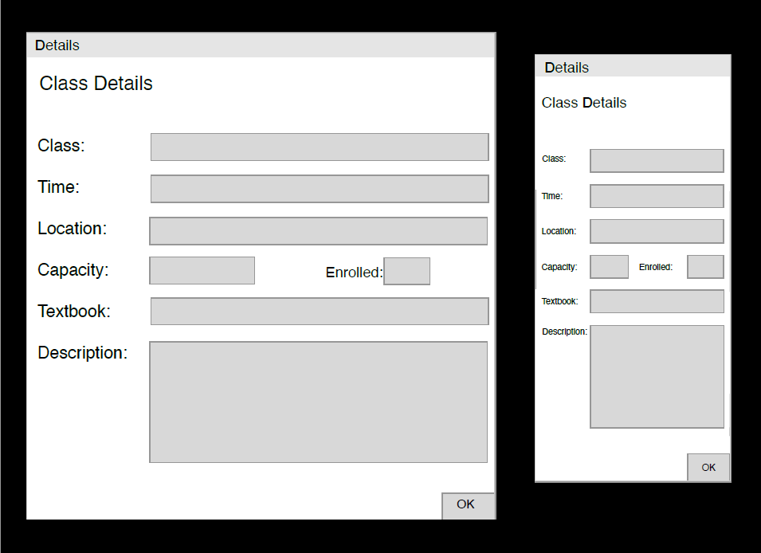
This mini-window is for checking a class details, and is part of the overview page. 

### Add a new class Mini-window 
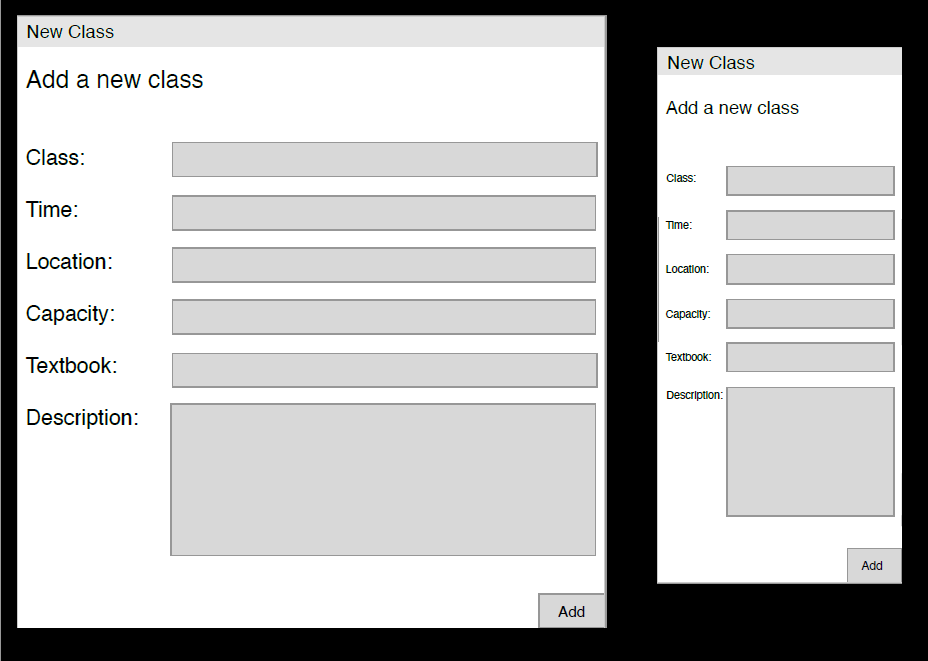
This mini-window is for adding a new class, and is part of the overview page.

### Remove class Mini-window 
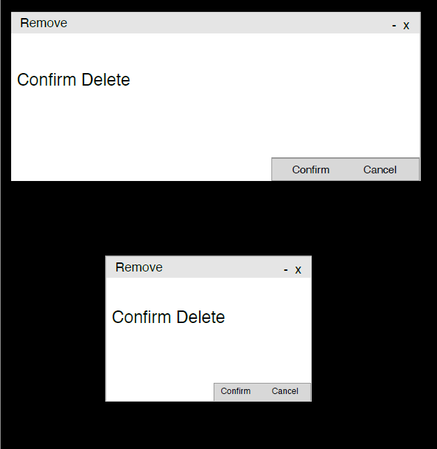 
This mini-window is for confirming removing a class before deleting, and is part of the overview page. 

## CSS Deliverable

#### Differences between wireframes and deliverable

Kim: When I drew the wireframes for this project, I felt that designing of website is not harder than my expectation because wireframing can be depicted as I thinking. When I writing HTML code, also, I felt that designing is not hard. The CSS deliverable, but, is totally different level. I spent a half-day aligning the index page's layout. After I decided that my CSS ability is not enough to implement, I used the Bootstrap framework. It is really powerful in terms of aligning content, designing the layout, and even responsiveness. Because of it, I can complete the CSS deliverable following my wireframes.  The biggest difference between the two is that designing a web page is impossible without understanding CSS, HTML, and several features such as display, box model, grid layout, selector, etc. Also,  implementation of responsiveness can be done with several techniques such as shrink font size, margin and padding, modifying the layout, and its design.

Asif:

