# Welcome to QCfirst

The final programming project of CS355
<a href="https://qcfirst-1.jihoonk1116.repl.co/index.html"> [liva app]</a> host by Repl.it
 (Use one of these codes to sign up: 1213 1211 1212 1210 1234 1203 1215)

<a href="https://github.com/jihoonk-1116/qcfirst/tree/main/apps">Server side source code</a> - Chihoon Kim & Asif Gani  
<a href="https://github.com/jihoonk-1116/qcfirst/tree/main/view/student">Student side source code</a> - Asif Gani 
<a href="https://github.com/jihoonk-1116/qcfirst/tree/main/view/instructor">Instructor view source code</a> - Chihoon Kim

#### Contributors:
Chihoon Kim (https://github.com/jihoonk-1116) 
Asif Gani (https://github.com/ganiasif98)

#List of Features

##Student Side Features
* Students are able to edit profile information.<a href ="https://qcfirst-1.jihoonk1116.repl.co/student/html/stu_overview.html">[Edit Profile]</a>
* Students can search and enroll classes.<a href ="https://qcfirst-1.jihoonk1116.repl.co/student/html/search_class.html">[Search and Enroll Class]</a>
* Students are able to drop or view classes. Classes must be added in order for a student to drop or view the class.<a href ="https://qcfirst-1.jihoonk1116.repl.co/student/html/enroll_class.html">[Drop or View Class]</a>
* Students can view their schedule in the schedule section under the student overview page that is automatically generated once you add a class.<a href ="https://qcfirst-1.jihoonk1116.repl.co/student/html/stu_overview.html">[View Schedule]</a>

## Instructor Side Features
* Instructors are able to add new classes that students can register for by clicking the "register new class" button in the instructor overview page.<a href="https://qcfirst-1.jihoonk1116.repl.co/instructor/html/overview.html">[Register New Class]</a>
* Instructors are able to view students who register for their class in the roster page.<a href="https://qcfirst-1.jihoonk1116.repl.co/instructor/html/roster.html">[View Roster]</a>
* Instructors can view their schedule in an auto generated schedule maker.<a href="https://qcfirst-1.jihoonk1116.repl.co/instructor/html/schedule.html">[View Schedule]</a>

# Deliverables
* [User management Deliverable](#d4)
* [CSS Deliverable](#d3)
* [Final Demo](#d5)

#Frontend/Client-Side Technologies
In our final demo the choice of frontend we decided on was incorporating bootstrap into our html and CSS for styling. 
We also incorporated CSS into our webpage to have that professional feel. We also included jquery into our final demo mainly to 
make an AJAX request to the backend server. 

#Backend/Server-Side Technologies 
In our final demo, the backend that we mainly used was nodejs, express framework and mongoDB.
We used express because it is one of nodejs framework that made it really simple to configure a server. 

#Choice of Database
For our database choice we went with monogDB. We used MongoDB because 
it was a mongoose framework that offered several convenient methods 
that made it easy to communicate the backend with the database. MongoDB 
made it easy to find data or data sets using a single method either, find(key) or 
findOne(key).

# Visual Designs of QC first
* [Site](#sitemap)
* [Login Page](#login)
* [Sign-up Page](#sign-up)
  

* [Student](#student)
    * [Student-Overview](#student-overview)
    * [Add classes](#add-class)
    * [Edit-Profile-Window](#edit-student-profile)
    * [Enroll-Class](#enroll-class)
  
  
* [Instructor](#ins)
    * [Overview](#overview-ins)
    * [My Schedule](#schedule)
    * [Roaster](#roaster)
    * [Student Details Mini-window](#student-details-ins)
    * [Class Details Mini-window](#class-details-ins)
    * [Add a new class Mini-window](#add-mini-ins)
    * [Remove class Mini-window](#remove-mini-ins)
   
## Site Map 
# 
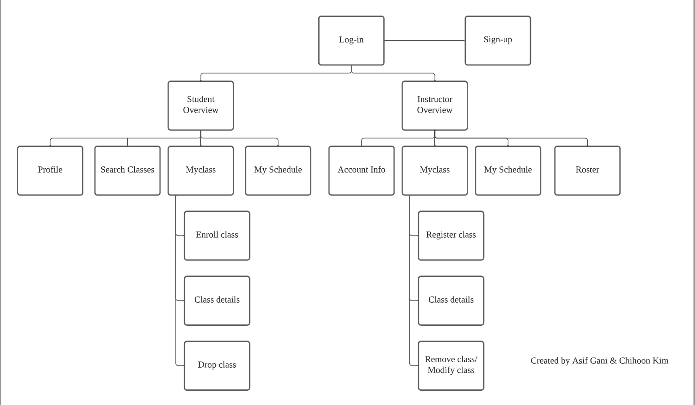

## Login Page 
# 
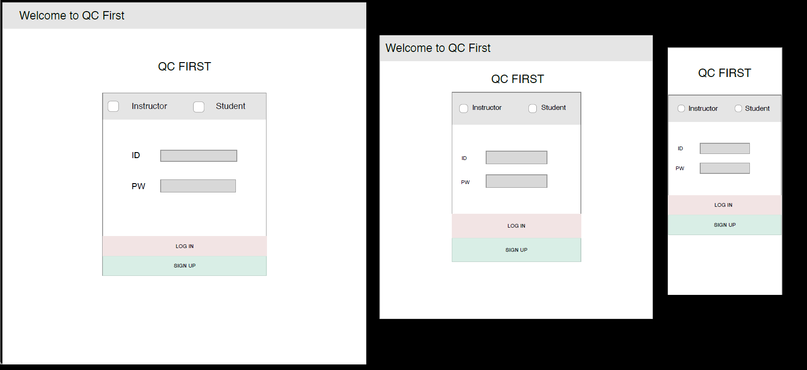
Log-in page decides that a user is a student or an instructor. <a href="instructor\index.html" target="_blank">[Code]</a><a href="https://jihoonk-1116.github.io/final/index.html" target="_blank"> [Page]</a>

## Sign-up page
# 
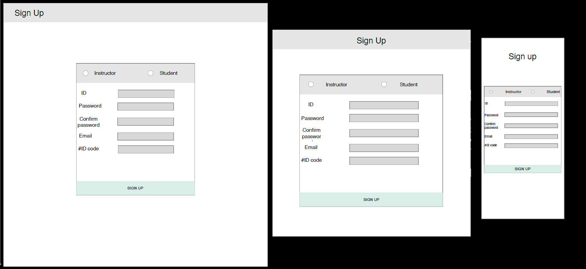
Users who want to sign-up are required their unique given number. <a href="instructor\signup.html" target="_blank">[Code]</a><a href="https://jihoonk-1116.github.io/final/signup.html" target="_blank"> [Page]</a>

# Student side

### Overview page
# 

On this page you are able to view the information about the student, view their schedule for that semester, and a link to add classes. 
<a href="Student\student_overview.html" target="_blank">[Code]</a><a href="https://ganiasif98.github.io/Final/student_overview.html" target="_blank"> [Page]</a>

### Edit Profile Mini Window
# 
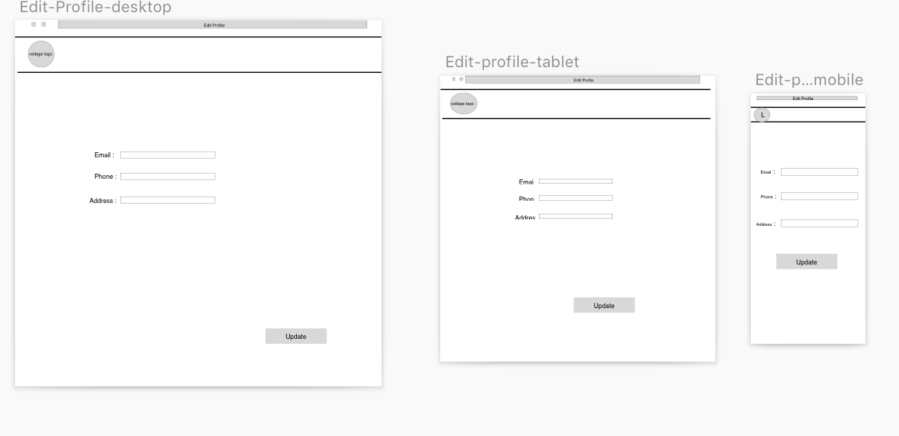
This is a window that will be opened when the edit profile button is clicked, and here you can update the information about the student.
<a href="Student\edit_profile.html" target="_blank">[Code]</a><a href="https://ganiasif98.github.io/Final/edit_profile.html" target="_blank"> [Page]</a>

### Add Class
# 
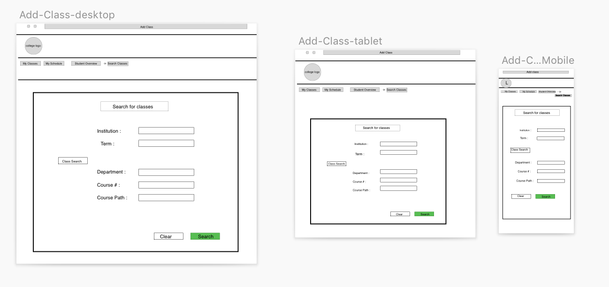
Here students can search classes depending upon which college they go to, the semester they want to search classes from, as well as the course #, or name. Also have the option to modify the search or clear the search.
<a href="Student\search_class.html" target="_blank">[Code]</a><a href="https://ganiasif98.github.io/Final/search_class.html" target="_blank"> [Page]</a>

### Enroll Class
# 
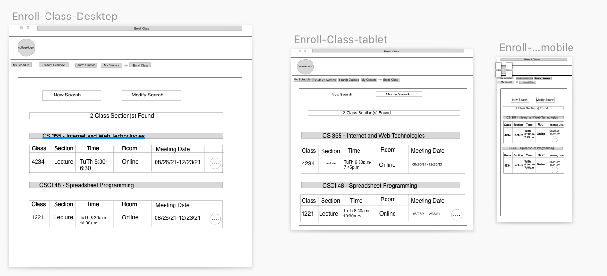
Here students can view all the classes that corresponds to the given search in the previous window By the clicking the 3 dots you are redirected to another link where you can add the class.
<a href="Student\enroll_class.html" target="_blank">[Code]</a><a href="https://ganiasif98.github.io/Final/enroll_class.html" target="_blank"> [Page]</a>

### Detail Page 1
<a href="Student\class_detail.html" target="_blank">[Code]</a><a href="https://ganiasif98.github.io/Final/class_detail.html" target="_blank"> [Page]</a>

### Detail Page 2
<a href="Student\class_detail2.html" target="_blank">[Code]</a><a href="https://ganiasif98.github.io/Final/class_detail2.html" target="_blank"> [Page]</a>

# Instructor side 
### Overview page 
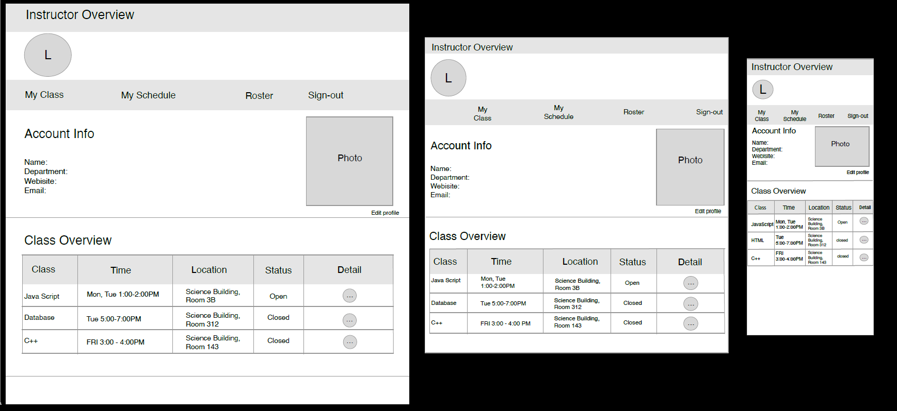
This page gives overall information about a instructor's class. 

### My Schedule 
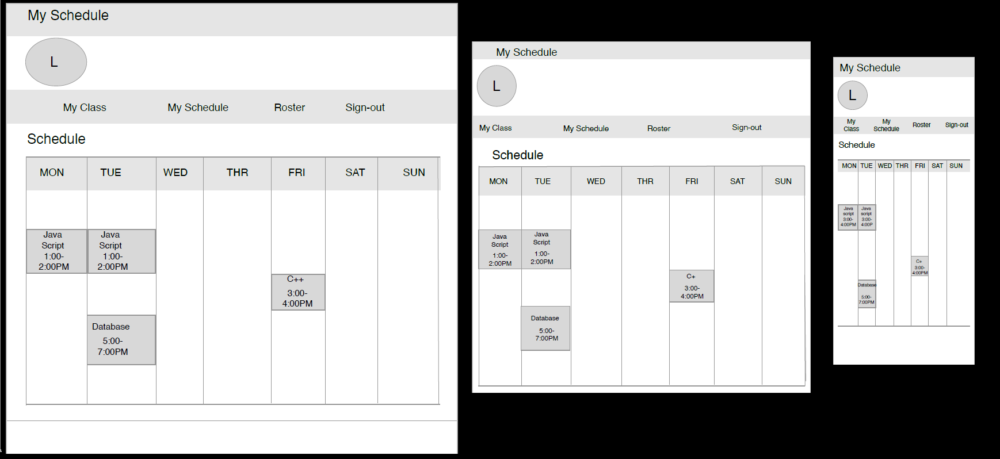
Instructors enable to check his or her schedules visually on this page.

### Roster 
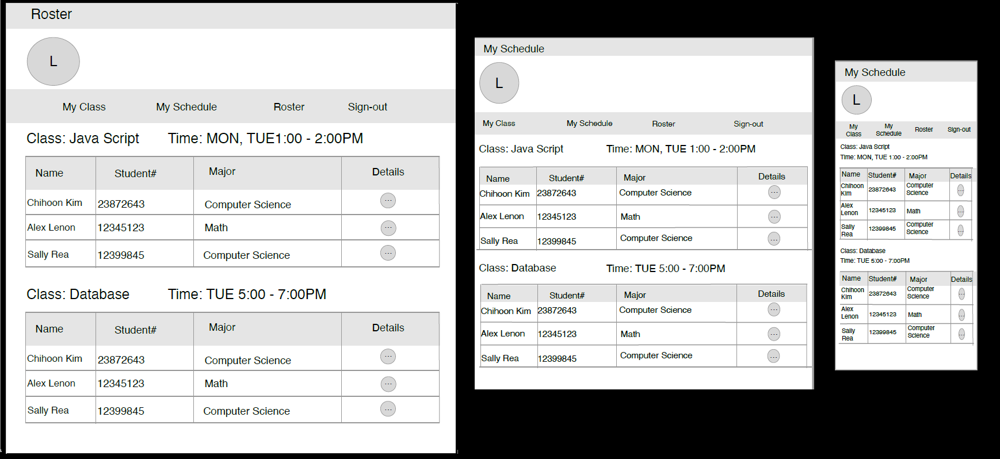
Instructors can access students' information who register the instructor's class. 

### Student Details Mini-window 
##### *All of these Mini-window designs are using 8-grid for desktop, tablet  and 4-grid for mobile.
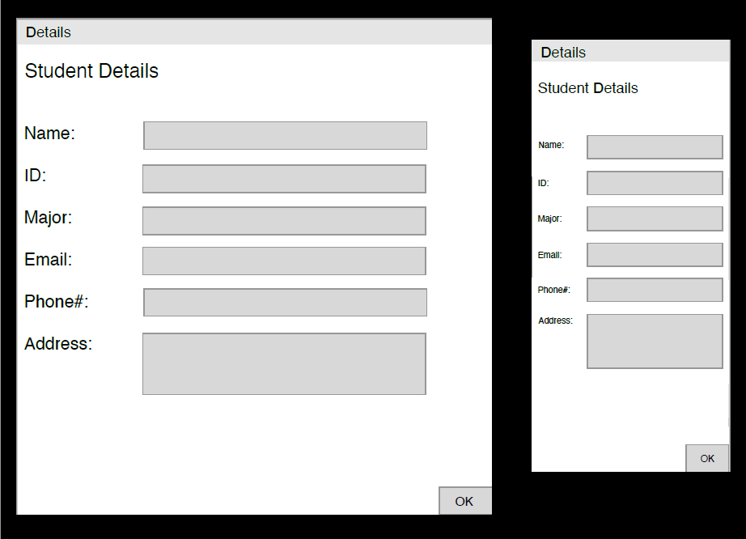
This mini-window is for checking a student details, and is connected with the roaster page.

### Class Details Mini-window 
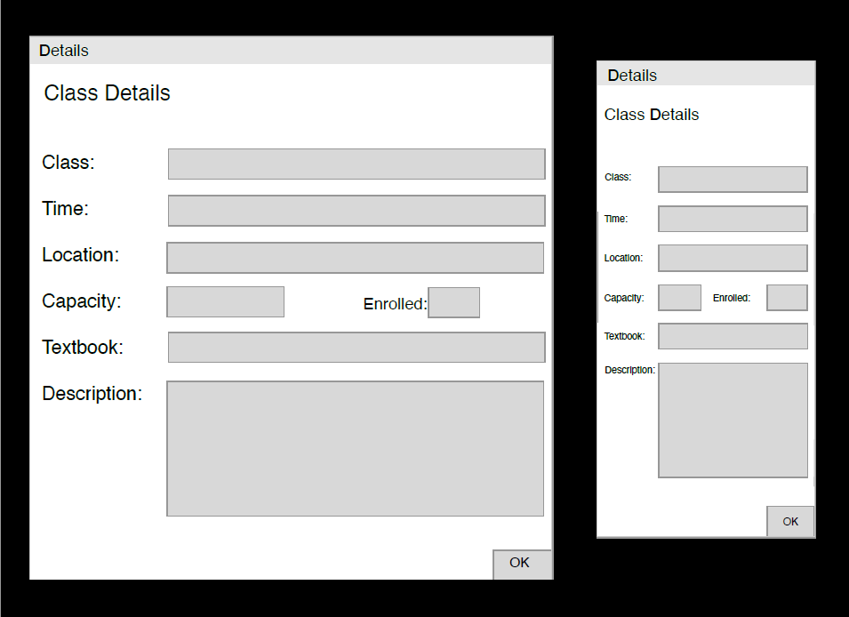
This mini-window is for checking a class details, and is part of the overview page. 

### Add a new class Mini-window 
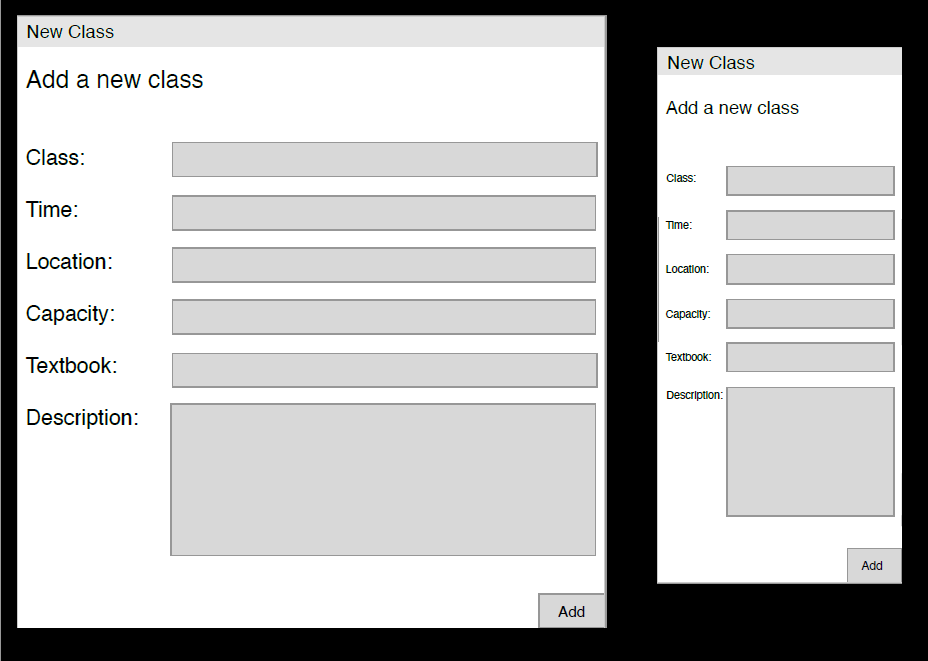
This mini-window is for adding a new class, and is part of the overview page.

### Remove class Mini-window 
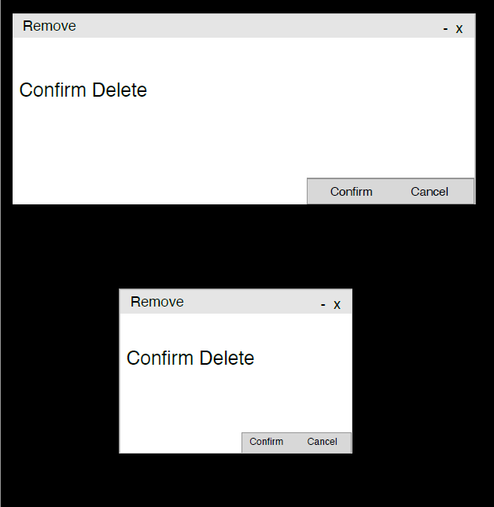 
This mini-window is for confirming removing a class before deleting, and is part of the overview page. 

## CSS Deliverable 

#### Differences between wireframes and deliverable

Kim: When I drew the wireframes for this project, I felt that designing of website is not harder than my expectation because wireframing can be depicted as I thinking. When I writing HTML code, also, I felt that designing is not hard. The CSS deliverable, but, is totally different level. I spent a half-day aligning the index page's layout. After I decided that my CSS ability is not enough to implement, I used the Bootstrap framework. It is really powerful in terms of aligning content, designing the layout, and even responsiveness. Because of it, I can complete the CSS deliverable following my wireframes.  The biggest difference between the two is that designing a web page is impossible without understanding CSS, HTML, and several features such as display, box model, grid layout, selector, etc. Also,  implementation of responsiveness can be done with several techniques such as shrink font size, margin and padding, modifying the layout, and its design.

Asif: Overall, when I drew up the wireframe for this project, I felt the design would be as hard as creating the wireframe and so the wireframe was only portraying what I was thinking at that moment. As I progressed into the design portion and I started doing CSS, the design portion felt not as overwhelming as the wireframe. We felt that including bootstrap into our HTML made the design much smoother and I was able to include small details in the html that made the design much easier to navigate. I was able to add the class details and the edit profile using bootstrap instead of having seperate html files for each. 

## User management Deliverable 

This app is used Nodejs and Express for the backend server, and mongoDB for database. User management required us to implement input validation and a few of APIs, such as creating new user data, checking the user authentication, updating the user profile on the profile section. 

 #### Front-end user validation
 
 For the user validation, the email field checks to see if the email entered is a qc email. The email is valid if it follows the pattern "Hello.World55@qc.cuny.edu". If any other email is entered the form will not be submiited and an error message is displayed. For the name field the user must enter a first and last name. If only the first name is entered then an error message is shown to enter full name. The name field should be entered as "Example Name". For the password field it checks to make sure that the password as one capital letter followed by lower case letters followed by a number followed by a special character. If the password field is not entered correctly an error message is displayed saying the password must have all required information. A password example would be "Example21." The confirm password field checks to password entered in the previous field and if the password matches the confirm password entered a message is displayed that states that the password is a match.
 
 
 #### Log-in & sign-up and authentication system
  For the system, we need to implement user APIs to handle user data with our DB. First, the model for user schema is needed to store in MongoDB. The schema is composed of like the figure:  
  
  
  
  
 The code and email fields are unique so that a user has one unique code and eamil. Then, /signup API is implemented to save user information. We used 'bicypto' to encrypt password and 'mongoose' to interact with our database. The logic stream for the API like this: 
 Parse request -> encrypt password using bcypt -> code check using mongoose method(findOne()) -> if the code is valid -> Create user and save -> if the user's code and email is not duplicate value -> Server response to the frontend with JSON data.  
 
 

Next API is /login API. It supports a user who wants log in the website with his email and password. The request for the API begins with user's role, email and password. Then, The API checks the user is registered using findOne() method. If the user was registered before signing in, a JSON Web Token is being issued for the user with the secret key what we made. Then, the token data is being returned, and the frontend parse the response using .json() method. If the token is not error, the token is being stored it in localStorage.
 

Third API is /getuserinfo API. This API is to update overview's profile section and to manipulate DOM contents dynamically depending on the user who successes log in. For acquiring the user data, the token that is created before must be handed over to the backend and be attached requested header.  

 

Then the server can check and use the token to validate the user and get user data from database. At this part, JWT decode() method is used with server secret key that we initialized before. If the token is valid(the user is a registered user), then the user information is being returned as JSON data. If the response is successfully transferred to the frontend, then it manipulates HTML contents using selecting class and id.    

#### Our Feedback

Chihoon: When I was implementing the login and sign up authentication system, 
I was able to use Nodejs and Express for the backend server, and mongoDB for database. 
I found that it was easier to use mongoDB for our database because we didn't have to create tables to store our data and also because mongoDB supports several methods of backend programming that saved us a lot of time and space. 
Deliverable 4 required much more debugging than previous deliverables, but I feel we created a successful user management backend that will help us through the remaining deliverables.

Asif: overall, deliverable 4 was by far the most difficult. 
Getting the student-overview page to match the information that was entered in the sign-up page took me the longest to do. 
I was able to successfully implement the user validation section using regex expressions for the email, name and password. 
I was able to get a better understanding of using JSON and Ajax to implement the student-overview js file. 
Overall, I have learned a lot from this deliverable that will help when it's time to implement a fully functional QCfirst website.

## Final Demo 

#### differences between visual design and final outcome
When developing our final demo, we noticed a difference in the visual designed compared to when we first designed our webpage. 
One major difference we noticed was that in the visual design, we had multiple pages that handled different functions of the webpage.
In our final demo, we were able to include bootstrap into our webpage in order to handle pop-up menus causing us to eliminate unnecessary pages that weren't needed. 
In the student section of the webpage, we were able to convert the search class and enroll page into one by adding a button next to the searched classes that takes you to a mini-window where you can add the class. 
Overall, our final demo is well-structured and well-developed website that simulates the actions of a cunyfirst webpage.

